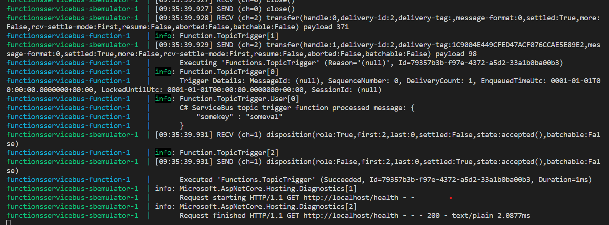

POC function app to send and recieve AzureServiceBus messages using the newly released [devopsifyme-sbemulator](https://github.com/piotr-rojek/devopsifyme-sbemulator).

To run locally docker needs to be installed, clone the repo then run 
` docker compose up -d` from the root folder.


Call the `TestTrigger` endpoint & pass some data that you'd like to send in the ServiceBus message.

```
curl --location 'http://localhost:7071/api/TestTrigger' \
--header 'Content-Type: application/json' \
--data '{
    "somekey" : "someval"
}'
```

Observe the output window to see the ServiceBusTriggered function pickup the message that was just posted

```functionsservicebus-function-1    | info: Function.TopicTrigger.User[0]
functionsservicebus-function-1    |       C# ServiceBus topic trigger function processed message: {
functionsservicebus-function-1    |           "somekey" : "someval"
functionsservicebus-function-1    |       }
```

